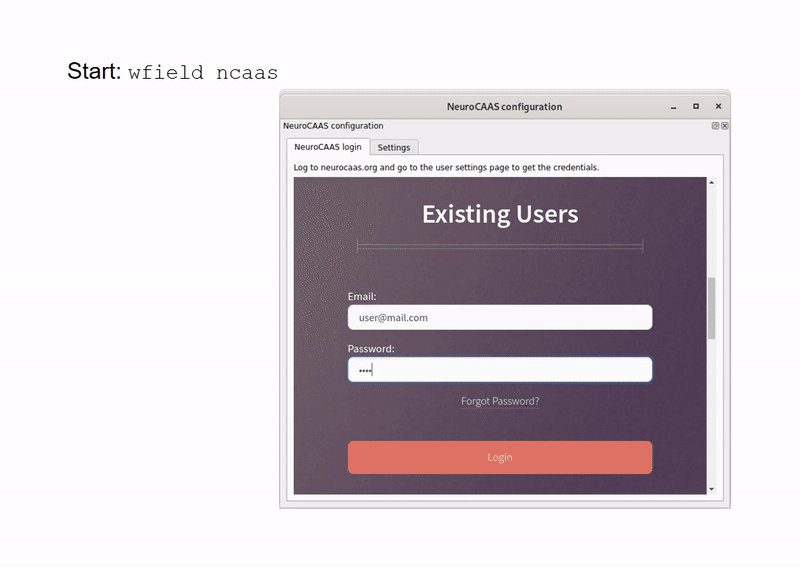
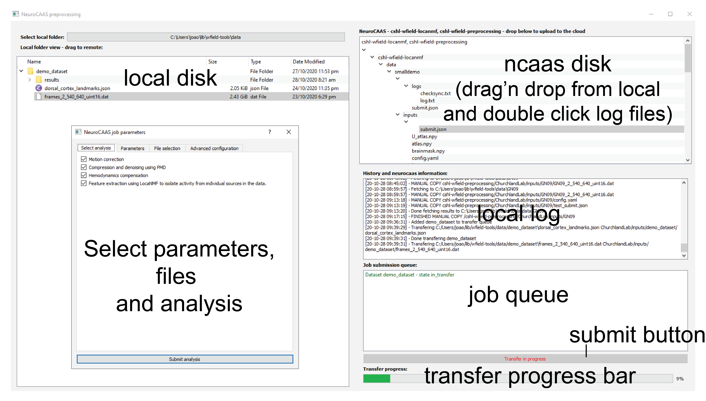

# Analysing data with NeuroCAAS

Motion correction, penalized matrix decomposition and hemodynamics correction are combined in a NeuroCAAS pipeline for a scalable and reproducible analysis pipeline.
The blueprint in on the ``wfield-preprocess`` and ``cshl-wfield-locanmf`` analysis buckets; you may need that when getting a NeuroCAAS [account](http://neurocaas.org) .

You can launch the analysis using the ``wfield ncaas`` graphical user interface. This is in a testing phase and we will migrate to the a new version of NeuroCAAS soon. Please raise a github issue if you need assistance using this.
If you want credentials to use this create an account on neurocaas.org and ask access to the ``wfield-preprocess`` and ``cshl-wfield-locanmf`` analysis buckets. 

### Getting a test dataset
To test the interface you can get a test dataset (50 trials collected by Simon Musall and Steve Gluf) from [here](https://drive.google.com/drive/folders/1ZKNaiLiJDp9b97PzT5mEP_Tdf2mCxKLm?usp=sharing). <br\>

To use the datasets, unzip each file to an **individual folder**. The software will treat each folder as a separate dataset. **Mac users: if you can not unzip the file type ``unzip FILENAME`` in the terminal.



### Using the ``wfield ncaas`` interface

Follow the instructions to [install wfield](https://github.com/jcouto/wfield/tree/dev#installation) before trying this.

1. Prepare a folder with data. The content in the zip files must be on a separate folder; i.e. different experiments need their own folder.
2. Open a terminal in the directory above where the experiment folders are and type ``wfield ncaas``. 
3. The window opens a browser to _neurocaas.org_. **Scroll down**: use your login information to log to neurocaas.org (you need to be added to the correct groups - ask the neurocaas admin). Upon successfull login the necessary credentials are copied (you can visualize the credentials and other settings in the 'advanced' tab). <br \> If you already have Amazon Web Services credentials those will be used and no prompt will appear (To delete existing credentials rename the ``~/.aws/credentials`` file). Close this window to save and continue.



3. This will start the graphical interface like in the picture above. Use this interface to **upload data** to NeuroCAAS, **running analysis** and **getting results** back. The next time you start the interface, step 2 will be skipped.

4. Drag and drop folders from the ``local disk`` to the ``NCAAS disk`` to add analysis to the ``local queue``. Folders should contain the raw data in **binary format**, a set of **tiff stacks**, or files recorded by the **WidefieldImager**. <br \> When you drag-and-drop a folder, a window opens where you can select the specific analysis.

5. Select the analysis to run and analysis parameters and click submit to close the dialog.

6. Nothing is uploaded until you press the ``Submit to NeuroCAAS``. This will transfer data from the **local queue** to the cloud and to start the analysis. The ``progress bar`` will show the copy progress of the files. The ``local log`` informs what commands are ran. <br />**Note**: To remove items from the queue: _double-click_ the item. You can not upload experiments with the same name.  

6. When the analysis completes, the **results are automatically copied** to the ``local disk`` deleted from the cloud. If the locaNMF analysis was selected and you registered to the allen using ``wfield open_raw <foldername>`` the results of data compresssion will be uploaded to the server to run the localNMF analysis.


**Note:** The log file and transfer queue are stored in the local computer and reloaded when starting ``wfield ncaas``.


**TESTING AND EXTRA FEATURES:**

You can launch jobs that have been ran before to test how the interface gets data from the server to your home directories. You can do that by following step 2 below. That will launch an analysis and the results will be copied to your local disk when the analysis completes.

1. To monitor log files, navigate to the logs folder in the ``ncaas disk`` and double click a file. The file is refreshed every 2 seconds if the ``watch file`` checkbox is selected.
2. To re-submit a job, right click the a ``submit.json`` and click 're-submit'.


# Use cases and notes

### Using the command line interface

The command line interface can be used for pre-processing and data visualization.

To get a list of commands available do:

- `wfield -h`

To preprocess WidefieldImager data do:

- `wfield imager_preprocess <DATAFOLDER> -o <LOCAL/DESTINATION FOLDER>`
- Complete example `wfield imager_preprocess C:\\data\\CSP23\\SpatialDisc\\12-Mar-2020 -o c:\\data\\CSP23\\SpatialDisc\\12-Mar-2020`


to list other options do:

- `wfield imager -h`

To launch the GUI to explore processed data do:

- `wfield open <FOLDER>`


## Developers: Integration with NeuroCAAS (what's on the remote server) 

##### Installation on Ubuntu 20.04 fresh install - no GUI 

```bash

# Download miniconda
wget https://repo.anaconda.com/miniconda/Miniconda3-latest-Linux-x86_64.sh
# install conda
bash Miniconda3-latest-Linux-x86_64.sh -b
echo 'export PATH=$PATH:$HOME/miniconda3/bin' >> ~/.bashrc && source ~/.bashrc
# install dependencies
conda install opencv tqdm scikit-image pandas natsort matplotlib
# clone and install wfield
git clone https://github.com/jcouto/wfield.git
cd wfield && python setup.py install
```
#### Motion correction example

This runs motion correction on a file and returns ``Y`` motion corrected array.
Use ``mmap = True`` to avoid loading the whole file to memory and overwrite on disk.

Saves a file to with the motion correction (x,y) shifts. Use `outputdir` to control where that gets written to.

```python
dat_path = '/mnt/dual/temp_folder/CSP23_20200226/frames_2_540_640_uint16.dat'

# This will load a file to memory, and return motion corrected data
from wfield.ncaas import load_and_motion_correct 
Y = load_and_motion_correct(dat_path,
                            chunksize = 1048,     # increase:use more memory
                            mmap = False,         # true: overwrite raw
                            flatten_frames=False) # true: return frames and channels as single dimension
```

#### Hemodynamics correction example

This performs hemodynamics correction on widefield data collected with 2 excitation wavelengths (470 and 405 nm). Result is saved in `SVTcorr.npy`.

```python

U = np.load('U.npy')
SVT = np.load('SVT.npy')

frame_rate = 30.        # acquisition rate (2 channels)
output_folder = None    # write to current directory or path

from wfield.ncaas import dual_color_hemodymamic_correction

SVTcorr = dual_color_hemodymamic_correction(U,SVTa,SVTb,
                                            frame_rate = frame_rate, 
                                            output_folder = output_folder);
					    
```